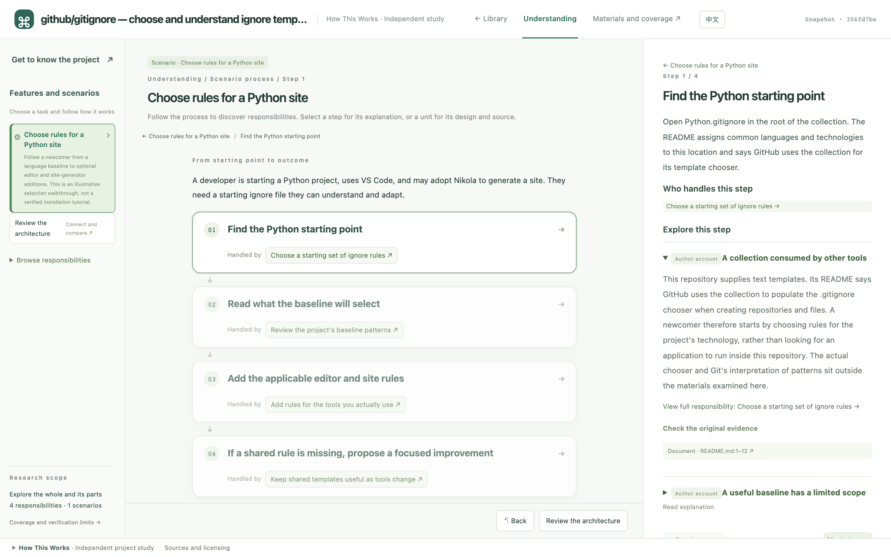
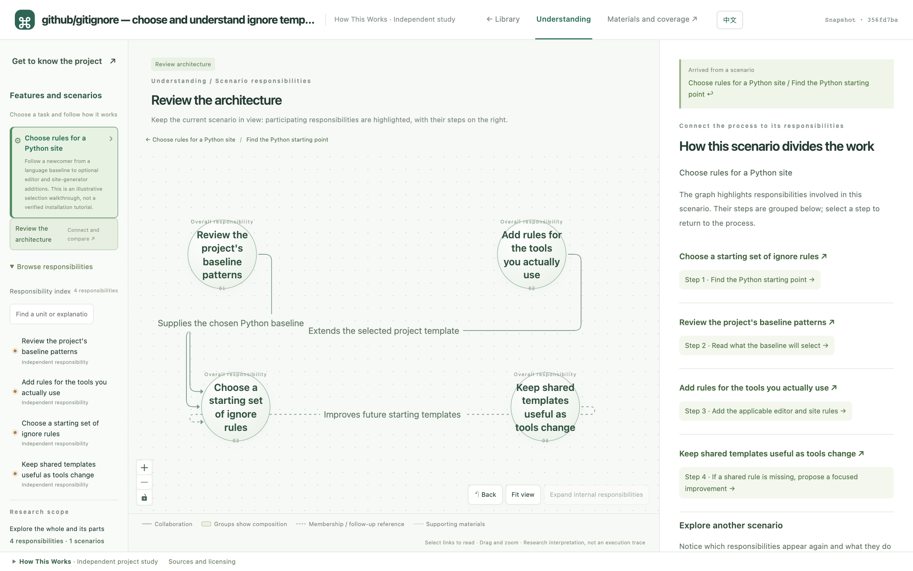
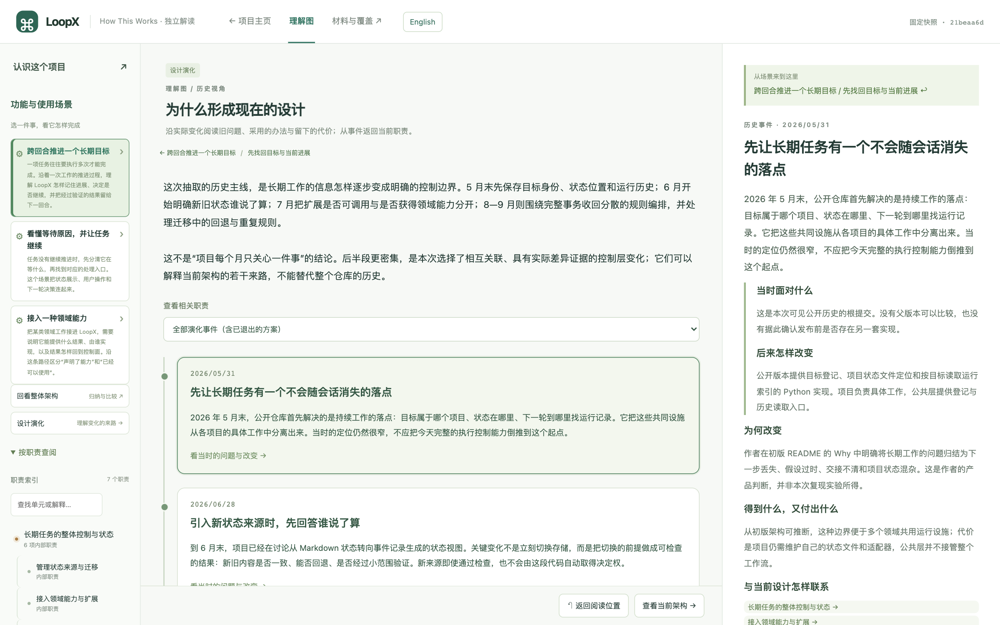

# How This Works

**Turn a repository into an interactive guide through its scenarios, architecture, and source.**

[简体中文](README.md) · **English**

You find an interesting project. What problem does it solve? How does one task move through it? Why do its parts work together this way? Can you check the explanation against the implementation?

How This Works is a Skill for coding agents. It guides an Agent through actual project materials, then uses a fixed template to build a learning website and a research index that other Agents can read. It works with code repositories as well as text-heavy Skills, documentation, and configuration projects.

> **The official showcase website is coming soon.** It will let you browse project studies created with this Skill. You can already use the Skill to study repositories of your own.



*An actual generated study of github/gitignore: follow a concrete task, then explore the responsibilities and implementation behind it.*

## Two ways to use it

| What you want to do | How to start |
| --- | --- |
| Understand your own project or another open-source repository | Give the Skill and a repository to your Agent to create a learning website. |
| Learn from an existing project study | Browse the project library, starting with purpose and scenarios before exploring architecture and implementation. The official online showcase is coming soon. |

## Follow a scenario. Explore the architecture. Check the evidence.

- **Start with what the project does.** Learn who uses it, for which task, with what inputs and outcomes. Reading the code first is not required.
- **Follow one task through the project.** Select a scenario step to see what happens, who handles it, and which conditions or exceptions matter.
- **Review the architecture.** Explore a graph of responsibilities and relationships, expanding details while retaining related context.
- **Check original materials.** Explanations link to a pinned version of the code or documentation. Browse the original directory structure to see covered materials and explanation gaps.
- **Trace history when needed.** Use commits and version differences to understand design changes, including approaches that were replaced or removed.
- **Keep asking your Agent.** The generated `agent/` index supports reading by scenario, responsibility, file, or historical event, so further research need not load the entire repository at once.



*Return from a scenario to connect the steps you just read with the project's division of responsibilities.*

<details>
<summary>See a design evolution example</summary>



This LoopX study is shown in Chinese. Historical research is added when requested and links explanations to the relevant older versions. Building a current architecture does not imply that the project's full history has been studied.

</details>

## Get started

You need **Git, Python 3.9+, Node.js 22.18+**, and an Agent that can read Skill instructions, access files, and execute local commands.

### 1. Prepare the Skill

After downloading this repository, install the Skill's dependencies from the repository root:

```sh
npm ci --prefix skills/how-this-works --ignore-scripts --no-audit --no-fund
```

Ask your Agent to read [`skills/how-this-works/SKILL.en.md`](skills/how-this-works/SKILL.en.md) to use it in this workspace. You can also copy the entire `skills/how-this-works/` directory into a Skill location supported by your Agent, then run `npm ci --ignore-scripts --no-audit --no-fund` inside that copy. To use the English instructions as the automatically discovered entry point, copy `SKILL.en.md` to `SKILL.md` in the installed copy. Its English reference documents are already included.

When distributing the Skill, retain its scripts, templates, and dependency lockfile. Leave out `node_modules`, caches, and research outputs. Preparing materials does not require installing or starting the project being studied.

### 2. Give your Agent a repository

Replace the example URL with a project you want to understand:

```text
Read skills/how-this-works/SKILL.en.md and use this Skill to study
https://github.com/github/gitignore.

Deliver an architecture-level study first: explain the purpose, main
responsibilities, and a representative usage scenario. Link explanations
to actual code or documentation, and identify areas not yet explored deeply.

Keep the study under ./studies/gitignore and use ./how-this-works-site
as the shared project library. Build the learning website and tell me
how to open it. Leave historical research for later.
```

Make your request in English or Chinese, or explicitly specify the language of the study. The Agent writes directly in that language; it does not need to generate Chinese first or produce two language versions of every project.

### 3. Open the generated website

A successful web build automatically adds the project to the chosen library. With the paths above, run this from the repository root:

```sh
python3 -m http.server 8790 --bind 127.0.0.1 --directory how-this-works-site
```

Open [http://127.0.0.1:8790/](http://127.0.0.1:8790/) in your browser. Use the same site directory when studying more projects to extend the library.

The **English / 中文** button switches only fixed interface text such as navigation, hints, and labels, preserving your reading position. Project explanations, historical prose, and source materials stay in their original language.

## Understand the architecture, then choose how deep to go

| Delivery target | What you get |
| --- | --- |
| `architecture` | Evidence-backed main responsibilities, key relationships, and representative scenarios, with unexplored areas identified. A starting point for understanding a project. |
| `complete` | Continued research in the same study to fill explanation-assignment gaps, reusing existing units, evidence, and reading records. |

Add historical research when needed. Once an architecture study exists, you can also give your Agent the generated `agent/` index directory and the Skill, then describe a question to investigate. Opening a webpage does not automatically send your reading position to an Agent.

Scripts handle material collection, indexing, version and reference checks, coverage statistics, and web builds. The Agent reads, judges, and explains. Complete coverage or valid references do not guarantee correct explanations; the site retains research boundaries and access to original evidence.

## Further reading

- [Current project commands: prepare, read, edit, and build](skills/how-this-works/references/material-supply.en.md)
- [Research input contract](skills/how-this-works/references/current-model.en.md)
- [Historical research commands](skills/how-this-works/references/commands.en.md)
- [Writing for new readers](skills/how-this-works/references/reader-friendly.en.md)

Screenshots show actual locally generated learning pages. How This Works provides independent project studies, not upstream endorsements. Before publishing generated pages, check the original materials' licensing and attribution requirements.
