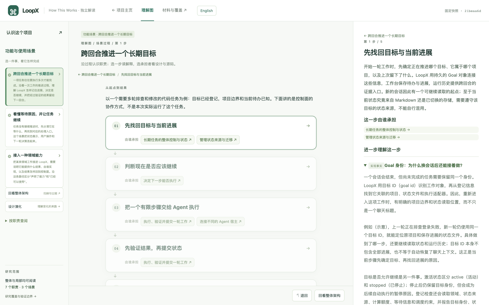
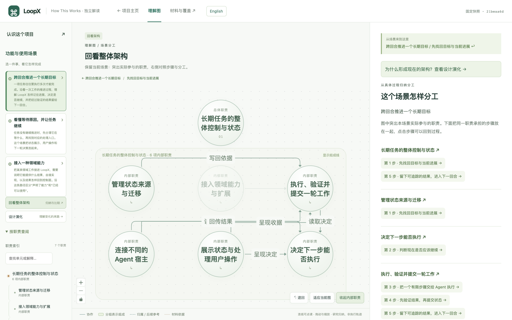

# How This Works

**把一个仓库，变成可以沿着场景、架构和源码学习的交互式网站。**

**简体中文** · [English](README.en.md)

遇到一个感兴趣的项目，你想知道的不只是“它有哪些文件”，还有：它解决什么问题？一次任务怎样完成？各部分为什么这样协作？关键解释能否在实现中找到依据？

How This Works 是一个供 Agent 使用的 Skill。它让 Agent 从真实材料中研究项目，再用固定模板生成学习网站和可供后续 Agent 读取的研究索引。适用于代码仓库，也适用于以文字为主的 Skill、文档和配置项目。

**我们主推架构解析：先看懂一个项目如何运作。** 从用途和场景进入各部分的分工与协作，关键解释关联真实实现。需要了解具体机制时，再继续深读；想知道设计如何走到今天，再研究历史。

> **展示网站：[How This Works](https://www.how-this-works.cn/)。** 本仓库维护 Skill、通用脚本和网页模板；网站的解析内容、分类与发布配置由独立的私有网站仓库维护。网站按各次发布更新，不等于本地全部研究均已上线。



*实际生成的 LoopX 学习页面：先跟随一件具体的事，再进入承担它的职责与实现。*

## 两种使用方式

| 你想做什么 | 如何使用 |
| --- | --- |
| 理解自己的项目或其他开源项目 | 把 Skill 交给 Agent，提供仓库，生成自己的学习网站。 |
| 直接学习已经整理好的项目 | 浏览[项目学习网站](https://www.how-this-works.cn/)，从用途、场景进入架构与实现。 |

## 三种研究方式，按需要选择

| 方式 | 适合回答的问题 | 得到什么 |
| --- | --- | --- |
| **架构解析 · 推荐从这里开始** | 这个项目有什么用？一件事怎样完成？各部分如何协作？ | 项目介绍、场景路径、职责与关系构成的理解图，以及关键解释的代码或文档依据。说明尚未深入的范围。 |
| **深度理解 · 按问题继续** | 这个机制具体怎样实现？哪些条件、异常或限制会影响它？ | 在已有职责和场景中补充实现细节与边界，必要时修正原有解释。可以只研究关心的问题。 |
| **历史演化 · 按需加入** | 现在的设计从何而来？过去尝试过什么，又为什么替换或删除？ | 关联当前职责的演化事件、前后版本证据，以及有依据的取舍说明；无法确认的动机保留为未知。 |

架构解析也需要阅读实现，但不追求逐文件解释。深读与历史是两种可选的继续研究方向，不必每个项目都走完三种方式，也不必先做全库深读才能研究历史。

截至 2026 年 9 月 22 日，本地学习库已整理 **135 个项目**，此前的批量研究以架构解析为目标，覆盖 Agent 框架、编码助手、Skill、记忆与上下文、评测与验证等主题。少量项目另有历史研究；这个数量不代表 135 份全库深度解析，也不代表全部已经公开上线。

## 从场景走到架构，再回到证据

- **先知道项目能做什么。** 从使用者、具体任务、输入和结果开始，不要求读者先看代码。
- **沿着一件事理解协作。** 点击场景中的步骤，查看发生了什么、由谁承担、有哪些条件与例外。
- **回看整体架构。** 理解图连接职责与关系，支持展开深入，并保留相关上下文。
- **随时核对原文。** 解释关联固定版本的代码或文档；材料页保留原有目录结构，可查看已覆盖内容与解释缺口。
- **按需研究历史。** 从提交及版本差异解释设计如何演变，也保留被替换、被删除的方案。
- **继续向 Agent 提问。** 生成的 `agent/` 索引支持按场景、职责、文件或历史事件读取，便于接着研究，不必一次塞入整个仓库。



*从一个场景回看架构，把刚读过的步骤与项目分工联系起来。*

<details>
<summary>查看历史演化示例</summary>


历史研究按任务需要展开，解释关联当时版本的证据；不会因为生成了当前架构，就声称已经研究过完整历史。

</details>

## 深读与历史，能多学到什么？

我们用 Luna 在 Ponytail 和 Loop Anything 的已有架构研究上继续深读，再补充历史。下面是实际产物中的少量例子；它们展示新增认识，不是把架构介绍写得更长。

### 深度理解：把功能概述落到具体边界

- **Ponytail：多宿主共享规则，怎样避免副本漂移？** 深读发现，检查器将七个指定副本与精简版规则比较，并在完整 Skill 与精简版中检查九条关键短语。它能发现特定差异，但不是从完整 Skill 自动生成、同步所有副本。读者因此知道“一致性检查通过”究竟保证了什么。[查看固定版本的检查器](https://github.com/DietrichGebert/ponytail/blob/e3ba2aa6f1e6f0bc4d69eb09c9f0d0a93af56156/scripts/check-rule-copies.js)。
- **Loop Anything：阶段与轮次预算由谁执行？** 沿 CLI 继续读，能看到它校验阶段名称、生成提示和状态文件，却没有据活动状态强制阶段转换或累计执行轮数。实际推进仍依赖 Agent 与操作者遵循约定，这决定了使用者应如何理解它的“循环”。[查看固定版本的 CLI](https://github.com/rossinsilico/loop-anything/blob/b817268b1cd4b9abdc2581194f8bbc5c517e6cf3/src/cli.js)。

### 历史演化：找回当前版本中已经消失的选择

- **Ponytail：为什么撤回一项网页资料查询规则？** 历史显示，该规则曾加入常驻 Skill，后来因外部 CLI 的可用性、常驻上下文负担和镜像同步问题被移除。只读当前版本，看不到这次尝试，也就无法学习这项取舍。[查看撤回提交及作者说明](https://github.com/DietrichGebert/ponytail/commit/cf9cbd531eb988c87ee82fcd6d2a3a3f0a3bd9b7)。这次研究从固定版本的 213 条第一父链提交中整理出 17 个演化事件。
- **Loop Anything：统一入口是怎样形成的？** 固定版本前的四次提交展示了从模板安装与检查，到阶段交接提示，再到工作对象与预算约定、统一 Skill 入口的形成过程。它适合学习一个设计如何起步；四次提交集中在同一天，不能据此推断长期优化趋势。[查看该快照的提交历史](https://github.com/rossinsilico/loop-anything/commits/b817268b1cd4b9abdc2581194f8bbc5c517e6cf3/)。

这两份新增实例的交互网页已在本地构建，尚未公开上线；上方链接指向对应版本的原始依据。研究复用了已有架构与证据，并经过引用修正和重点核对；属于静态阅读，没有运行上游项目，也没有宣称完成全库解释。

## 开始使用

需要 **Git、Python 3.9+、Node.js 22.18+**，以及能够读取 Skill、访问文件并执行本地命令的 Agent。

### 1. 准备 Skill

下载本仓库后，在仓库根目录安装 Skill 自身的依赖：

```sh
npm ci --prefix skills/how-this-works --ignore-scripts --no-audit --no-fund
```

然后让 Agent 读取 [`skills/how-this-works/SKILL.md`](skills/how-this-works/SKILL.md)，即可在当前目录使用。也可以把整个 `skills/how-this-works/` 目录复制到你的 Agent 支持的 Skill 安装目录，进入安装副本后运行 `npm ci --ignore-scripts --no-audit --no-fund`。

分发 Skill 时保留脚本、模板及锁定依赖文件，不携带 `node_modules`、缓存或研究产物。准备材料不需要安装或启动被分析的项目。

### 2. 给 Agent 一个仓库

把下面的仓库地址替换成你感兴趣的项目：

```text
读取 skills/how-this-works/SKILL.md，按这个 Skill 研究
https://github.com/github/gitignore。

先交付架构理解：讲清用途、主要职责，以及一个有代表性的使用场景，
把解释关联到真实代码或文档，并说明尚未深入的范围。

研究产物放到 ./studies/gitignore，统一项目主页放到 ./how-this-works-site。
生成学习网页，并告诉我怎样打开。暂时不研究历史。
```

用中文或英文提出请求，也可以明确指定正文语言。Agent 直接用所选语言撰写研究，不必先生成中文再翻译，也不要求每个项目同时生成两种语言。

Skill 只维护一套英文指引：标准入口为 [`SKILL.md`](skills/how-this-works/SKILL.md)，配套 references 与 Agent 元数据也使用英文。直接用中文或英文提出请求即可；指引语言不限制解析正文语言，无需替换入口文件。

### 3. 打开生成的网站

网页构建成功后，项目会自动加入指定的项目主页。按上面的路径生成时，在仓库根目录运行：

```sh
python3 -m http.server 8790 --bind 127.0.0.1 --directory how-this-works-site
```

在浏览器打开 [http://127.0.0.1:8790/](http://127.0.0.1:8790/)。继续解析其他项目时，使用同一个站点目录即可更新学习库。

页头的 **English / 中文** 按钮只切换导航、提示和标签等固定界面文案，保留阅读位置；项目解释、历史正文和源码保持原样。

## 先理解架构，再决定读多深

已有架构通常就能帮助你开始学习和向 Agent 提问。把研究目录、生成的 `agent/` 索引和 Skill 提供给 Agent，描述想追问的部分即可。例如：

```text
继续已有研究，保留当前架构。深入解释其中的状态恢复机制：
状态由谁写入、恢复时读取什么、失败或冲突怎样处理？
沿真实实现核对，把新增解释和依据补回相关职责，再更新网页。
```

或者单独补充历史：

```text
继续已有研究，补充关键职责的历史演化。
从提交和前后版本解释重要方案的引入、调整与废弃，并关联当前职责。
区分作者明确说明的原因与研究推断；说明历史范围，再更新网页。
```

如果确实需要全库整理，可以要求继续补齐所有纳入范围材料的解释归属。这比定向深读范围更大。脚本的交付目标仍只有 `architecture`（架构理解）与 `complete`（完整整理）；深读和历史描述的是研究方式，不是新增的命令模式。

后续研究可以复用已有单元、证据和阅读记录。打开网页本身不会自动把阅读位置传给 Agent，需要描述自己的问题。

脚本负责材料采集、索引、版本与引用检查、覆盖统计和网页构建；Agent 负责阅读、判断和解释。覆盖完整或引用合法不等于解释必然正确，页面会保留研究边界与原文核验入口。

## 进一步使用

- **按期维护项目库**：每次选择榜单口径、范围和 Top N；新项目新增，已有项目按版本差异增量研究，保留旧解释与各期入选记录。领域和方向导航可折叠，网页由脚本构建。见[项目库与周期更新](skills/how-this-works/references/collection.md)。这不会自动创建定时任务或发布网站。
- [当前项目命令：准备、读取、编辑与网页构建](skills/how-this-works/references/material-supply.md)
- [研究数据输入约定](skills/how-this-works/references/current-model.md)
- [历史研究命令](skills/how-this-works/references/commands.md)
- [面向新读者的解释标准](skills/how-this-works/references/reader-friendly.md)

截图来自本地实际生成的学习页面。How This Works 提供独立项目解读，不代表上游官方背书；公开分享生成页面前，请核对原始材料的许可与署名要求。
